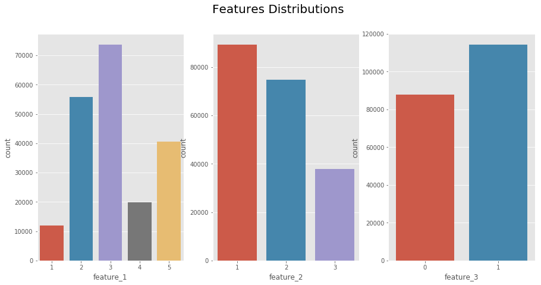
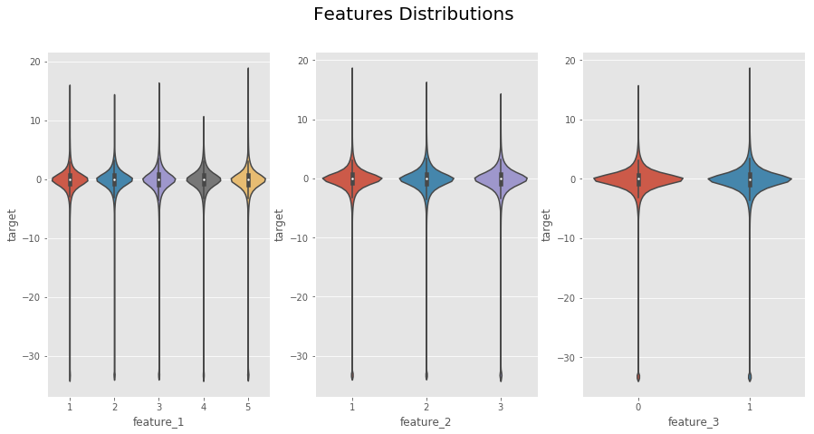
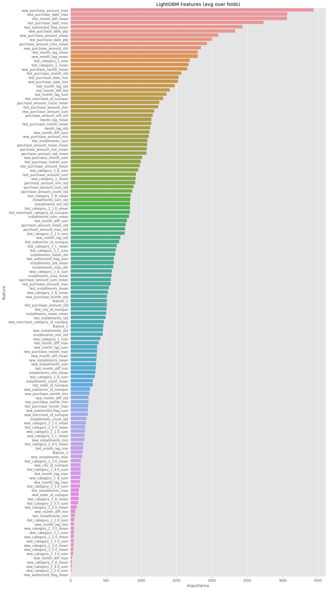

# Elo 
 one of the largest payment brands in Brazil, has built partnerships with **merchants** in order to **offer promotions or discounts** to **cardholders**
 
In this dataset we can see clients who use Elo and their transactions. We need to predict the loyalty score for each card_id.

###### elo wants to predict how happy client will be, given such offering (promotion), only by knowing his historical transactions

We really need to answer 2 Questions based on the Overview given :-
- Is this offer relevent to this User?
- How relevent is it?

### Exploring Target Variable.

well, its abit fuzzy. as it's distribution is normalized with Zero mean and low standard deviation, which means that it passed through Normalization process

##### the target variable is a ratio of number of promotions used by user divided by total number of promotions sent to such user

### Outliers
After knowing that these outliers are actually values that could occur also in test set ... which means that we ***should predict how to predict them** .. rather than ***neglecting*** ... From the elo overview ...

>In this competition, Kagglers will develop algorithms to identify and
serve the most relevant opportunities to individuals, by
uncovering signal in customer loyalty. Your input will improve
customers’ lives and <b style='color:red'>help Elo reduce unwanted campaigns</b>, to create
the right experience for customers.

Therefore ... these **Outliers** are not Outliers .... they are real (existing) values which Elo is concerned about.  
Neglecting them, The Model will not provide anything useful for **Elo's busniess**

the Outlier anonymized features frequency plot are almost identical to the whole data frequency ... which means such features are not good indicator to determine the 'outliered customer behavior' ... may be after merging the merchants' data sets going to see some insights ...

### The Three Anonymous features

Features are **Standard Normalized** ... which indicate the hiding of **Elo** for the real data values ... 

### Light-GBM Model Predictors

