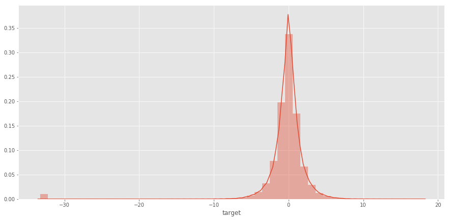

# Elo 
 one of the largest payment brands in Brazil, has built partnerships with **merchants** in order to **offer promotions or discounts** to **cardholders**
 
In this dataset we can see clients who use Elo and their transactions. We need to predict the loyalty score for each card_id.

###### elo wants to predict how happy client will be, given such offering (promotion), only by knowing his historical transactions

We really need to answer 2 Questions based on the Overview given :-
- Is this offer relevent to this User?
- How relevent is it?

### Exploring Target Variable.

well, its abit fuzzy. as it's distribution is normalized with Zero mean and low standard deviation, which means that it passed through Normalization process

##### the target variable is a ratio of number of promotions used by user divided by total number of promotions sent to such user

